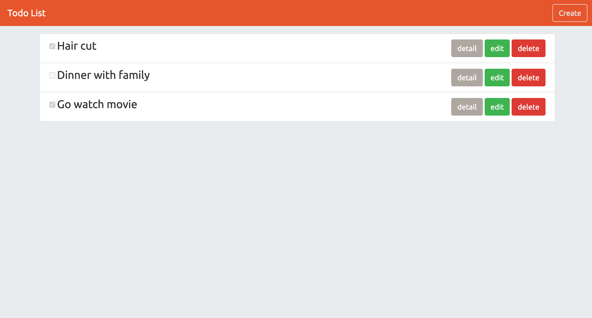

# Todo List

透過 Node.js/ Express/ MongoDB 實作一個備忘錄

## Preview



## Prerequisites

- Body-Parser v1.19.0
- Express v4.17.1
- Express-Handlebars v5.3.2
- Method-Override" v3.0.0
- Mongoose v5.13.2

## Installing

1. 打開終端機 (Terminal) 輸入以下訊息，下載專案至本機

```
git clone https://github.com/ravenera0317/todo-list.git
```

2. 進入專案目錄資料夾

```
cd todo-list
```

3. 安裝 npm 套件

```
npm install
```

4. 加入種子資料

```
npm run seed
```

5. 啟動伺服器來執行專案

```
npm run dev
```

6. 出現以下訊息即可打開瀏覽器輸入 http://localhost:3000 開始使用

```
App is running on http://localhost:3000
```
